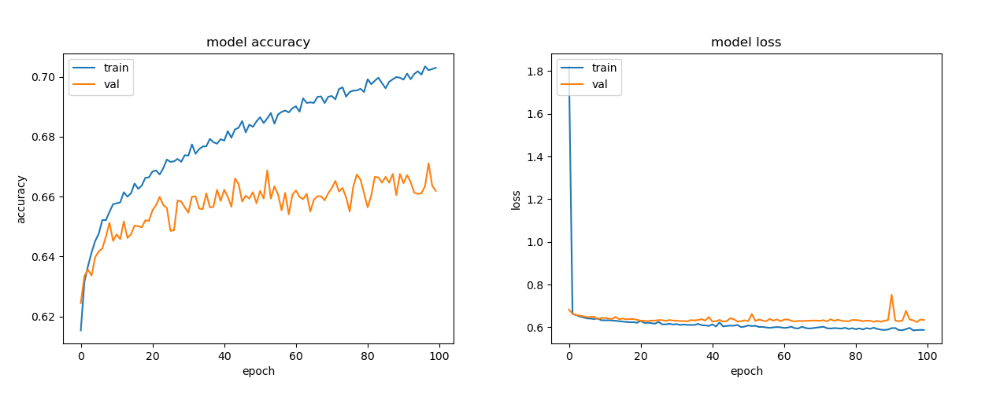

# DeepEarnings

This is a project which attempts to model whether a company will beat or miss earnings announcements based 
on previous financial data, sentiment analysis, and stock price movement using deep learning. For example, 
will the amount of long-term debt impact next quarters earnings? How about the amount of R&D spent? Do increases 
in volume contain information about upcoming earnings announcements? Deep learning pulls out complex, 
non-linear statistical dependencies in the data between every variable that are otherwise unobservable to humans. 
The end-goal is to develop trading strategies through reinforcement learning to develop a profitable algorithm. 

Feel free to also use these methods to gather earnings or 10Q/10K data. Also please message me with any questions 
or comments :) 

Current model test accuracy: 66.91%

Current model train accuracy: 71.11% 

Baseline: 57.5% bias in classes to beat earnings

Number of data points: 56621

Time range:  2010 - 2020

### Looking for collaborators / to-do list
Feel free to reach out to me if you're interested in collaborating. I'm looking for people who are experienced 
traders who might know how to develop trading strategies off of this. I'm also looking for people who have an
 interest in machine learning with finance applications.
Future ideas:
1. Use LSTMs/RNNs to track OHLCLV + technical indicators before earnings (I've sorta tried this and it sorta works,
need to clean it up before I commit).
2. Use advanced NLP methods on 10Q/10K datasets
3. Use reinforcement learning to develop trading strategies
4. Use alternative data (Google trends) 

## Getting Started

__Note: If you want to play around with these scripts using the small data set that I have provided, make sure 
to copy all of the folders in "Data" to the main directory with all of the scripts, or change the file paths 
in the scripts themselves but add the folder "Data". This is because I locally have the full data set that 
I don't want to commit to the repo. Also I suck at Git since I'm new so if there is some nice solution 
to this let me know.__

This project uses the R package "edgar" to scrape SEC 10Q/10K filings for sentiment analysis. 
You also need basic things like Pandas, scikit, and numpy. The neural networks will be built using Keras. 
I'm using PyCharm for everything so just download that and you can clone the repo. 
Also PyCharm will let you run R scripts. 

You're going to need a text file "list_cik.txt" which contains a list of company tickers and CIK numbers.
This list will provide the companies to the get_ZacksEarnings.R to scrape. If you don't plan on doing sentiment
 analysis, you don't need the CIK numbers. 

## Gathering the Data

### Scraping zacks.com earnings

Because I couldn't find access to consensus estimates for earnings easily, I scraped zacks.com for their earnings. 
For example, data are scraped from this link:
https://www.zacks.com/stock/research/AAPL/earnings-announcements

Run this in your terminal:
```
Rscript get_ZacksEarnings.R
```
This will create a directory "DirtyZacksEarnings" where it stores each earnings for a company in a text file.

### Financial Data

I have access to Compustat North American through my university. I don't think I'm allowed to share that data 
set because of their terms and conditions. If you do have access yourself, you can get this data set by querying 
Compustat - Capital IQ / Compustat / North America
Daily / Fundamentals Quarterly through Wharton Research Data Services. For the variables, select all of them.

If you don't have access to this data set, I recommend this free
API https://financialmodelingprep.com/developer/docs/ I'm not sure how reliable this website is, but it's hard to
come by free financial data. IEXCloud is probably another good choice, but it is not free after you hit a certain
number of requests. Also if you're a beast, you could manually get this data directly from the 10Q/10K documents
themselves. If you do end up using an alternative method, then you'll have customize your own script to clean
the data you gather.

This is the main chunk of data upon which the algorithm is trained on. The algorithm will receive data from balance 
sheets, cash flow, debt, and much more, from the previous quarter. From these data, the algorithm will try to 
predict if the company will beat earnings or not. 

### Downloading 10Q/10K files and sentiment analysis (optional)

Again this will require the text file "list_cik.txt". I'm using the R package "edgar", which to me as been the 
easiest way to scrap SEC filings. This package requires a CIK number to scrape filings from. The current 
sentiment analysis built in to the edgar package is very simple. It just counts the number of positive/negative 
business words. More advanced NLP methods would obviously be better, but I haven't gotten around to that.
``` 
Rscript get_SecSentiment.R
```

## Cleaning the Data

The data is converted to a Pandas data frame which has dates as the indexes. The time ranges are hardcoded to only 
be from 01/2008 - 01/2021 so if you're using data before hand or you're a time traveler then you need to change 
those in the script.

### Clean zacks.com earnings

After you have run the R script which gathers the earnings from zacks.com, you can now run the script to clean 
these text files into a Pandas data frame:
```
python pp_CleanZacksEarnings.py
```
This will make a data frame formatted like so. These are a few earnings from AAPL:

| Quarter (index for the df) | DateAnnounced | Estimate | Reported | Surprise | pctSurprise | AMC |
| --- | --- | --- | --- | --- | --- | --- |
| 2019Q2 | 2019-07-30 00:00:00 | 2.1  | 2.18 | 0.08 | 3.80952 | True |
| 2019Q3 | 2019-10-30 00:00:00 | 2.84 | 3.03 | 0.19 | 6.69014 | True |
| 2019Q4 | 2020-01-28 00:00:00 | 4.54 | 4.99 | 0.45 | 9.91189 | True |
| 2020Q1 | 2020-04-30 00:00:00 | 2.09 | 2.55 | 0.46 | 22.0096 | True |

### Clean compustat data
This script will save an X and y text files containing the training data with the labels. Rows correspond to 
samples while columns correspond to features. 

```
python pp_CleanCompustat.py
```
This will make a data frame formatted like so. These are a few entries for the Compustat Fundamanetals Quarterly for 
AAPL.

|Quarter (index for the df) | gvkey | datadate | fyearq | fqtr |  fyr | indfmt | ... | mkvaltq | prccq | prchq | prclq | adjex | spcseccd | 
| --- | --- | --- | --- | --- | --- | --- | --- | --- | --- | --- | --- | --- | --- | 
|2019Q2 | 001690 | 20190630 | 2019 | 3 | 9 | INDL | ... | 896853.6984  | 197.9200 | 215.3100 | 170.2700 | 1.0000 | 940 | 
|2019Q3 | 001690 | 20190930 | 2019 | 4 | 9 | INDL | ... | 995151.5669  | 223.9700 | 226.4200 | 192.5800 | 1.0000 | 940 | 
|2019Q4 | 001690 | 20191231 | 2020 | 1 | 9 | INDL | ... | 1287643.2104 | 293.6500 | 293.9700 | 215.1320 | 1.0000 | 940 | 
|2020Q1 | 001690 | 20200331 | 2020 | 2 | 9 | INDL | ... | 1099546.6542 | 254.2900 | 327.8500 | 212.6100 | 1.0000 | 940 | 

### Clean sentiment data (optional)
Same thing as above, must have ran the get_SecSentiment.R script before this one.
``` 
python pp_CleanSecSentiment.py
```
This will make a data frame formatted like so. These are a few entries for the sentiment analysis
for AAPL. lmWeakCnt are the number of Loughran-McDonald weak words in the 10Q/10K document.

| Quarter (index for the df) | CIK | CompanyName | FormType | DateFiled | ... | lmWeakCnt | lmUncerCnt | lmLitigCnt | harvNegCnt |
| --- | --- | --- | --- | --- | --- | --- | --- | --- | --- | 
| 2019Q2 | 320193 | Apple Inc | 10-Q | 2019-07-31 | ... | 157 | 367 | 236 | 1356 |
| 2019Q3 | 320193 | Apple Inc | 10-K | 2019-10-31 | ... | 177 | 438 | 265 | 1666 |
| 2019Q4 | 320193 | Apple Inc | 10-Q | 2020-01-29 | ... | 44  | 147 | 93  | 641  |
| 2020Q1 | 320193 | Apple Inc | 10-Q | 2020-05-01 | ... | 47  | 153 | 97  | 831  |

## Training the Network

This current iteration does not incorporate the sentiment analysis. I've tried it and it does not increase 
accuracy substantially, however I will be adding it back in the future for completeness.

### Multilayer perceptron for compustat quarterly financial data

__Preprocessing__

Financial data is messy because comapanies may omit certain financial data fields (Apple may not have reported their
good will for example). KNN imputation is a method used to fill in missing nan values based on closer points according
to some distance metric.

The data are also scaled by the market capitalization of every company to allow fair comparisons between companies'
financial data.

The data are also whitened (zero mean and unit variance across features) which can improve neural network training.

The data set contains 56621 samples after cleaning. Train:test:validation are 0.8:0.1:0.1. 

The network will contain two hidden layers with 250 hidden units each implented using Keras. SeLU activations were 
chosen opposed to ReLU for better test data. l2 regularization also reduced overfitting and improved test accuracy.
Dropout layers also helped reduce overfitting. 




